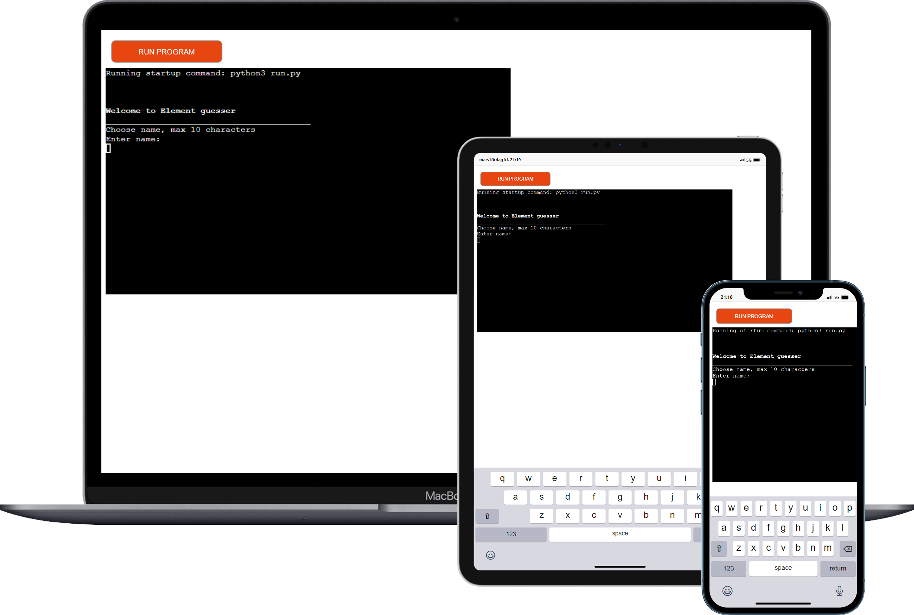
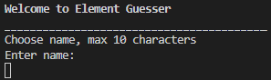
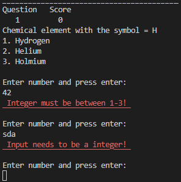
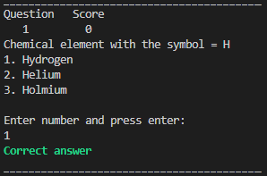
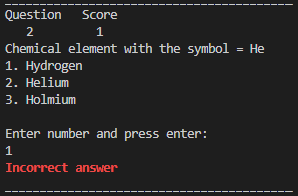
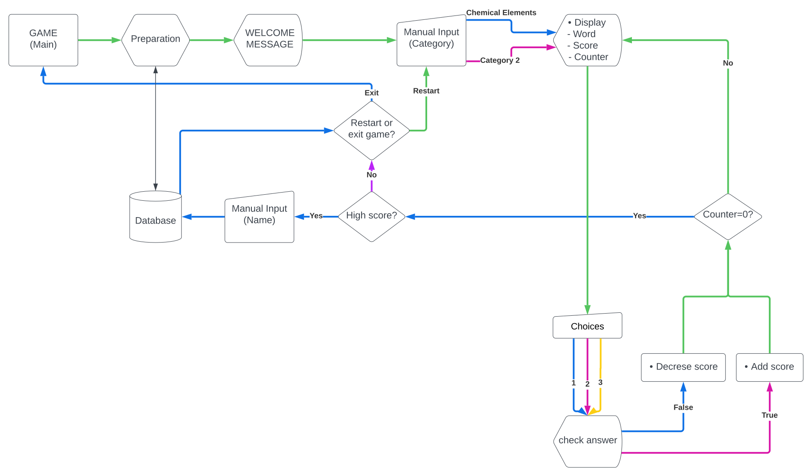

# Element Guesser

Element guesser is a word guesser game that runs on Heroku.

The player will have to guess which chemical element's symbol that goes with which element.

**[Play the game!](https://portfolio-project-3-ci.herokuapp.com/)**

## How To Play
 1. - In the beginning of the game you will get to choose a player name, choose a name and press enter.

 2. - After the name has been inputted you will get questions with 3 options in the terminal. Answer the questions with the number that goes with the option.

3. - keep answering questions until the game is over, then you will see the score for your round.

## Features
### Existing Features
  - Allow player to input a player name of maximun 10 characters
     - 

  - Checks the data that has been entered for the answer options, will only allow integers from 1-3
    - 

  - If the answer is correct the player will se a green text that says "Correct answer"
    - 

  - If the answer is incorrect the player will se a red text that says "Incorrect answer"
    - 
 
### Future Features
 - Highscore system that will save the highscore result in a file
 - More categories to choose from

## Lucid Chart
- Game main
  - Done ✓
- Preparation
  - Done ✓
- Manual input for category
  - Not done
- Display word, score and counter
  - Done ✓
- Provide 3 options
  - Done ✓
- Check the answer
  - Done ✓
- Highscore system
  - Not done

## Data Model
I used a class named Game for my model. T

## Testing

 ### Manual testing
  - Entered invalid data to see if the program will throw an error, exceptions in the code work fine.
  - Entered over 10 characters to see if the code will throw an error, 10 is the limit for player name. Works fine!
 - Tested thru python terminal on gitpod and in the terminal deployed on Heroku.
 ### Validator testing
  - Tested with Code Institutes Python linter, no errors occurred

## Deployment
This project was deployed using code institute's mock terminal for heroku.
  - Steps for deployment:
    - Fork or clone this repository
    - Create a new heruko app
    - Set the buildpack to **Python** and **nodeJS** in that order
    - Link the Heruko app to the repository 
    - Click **Deploy**

## Credits
- Code Institute for the deplolyment terminal