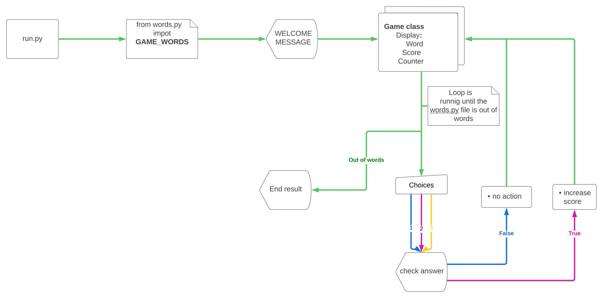

# Element Guesser

Element guesser is a word guesser game that runs on Heroku.

The player will have to guess which chemical element's symbol that goes with which element.

**[Play the game!](https://portfolio-project-3-ci.herokuapp.com/)**

## How To Play
 1. - In the beginning of the game you will get to choose a player name, choose a name and press enter.

 2. - After the name has been inputted you will get questions with 3 options in the terminal. Answer the questions with the number that goes with the option.

 3. - keep answering questions until the game is over, then you will see the score for your round.

## Features
### Existing Features
  - Allow player to input a player name of maximun 10 characters

  - Checks the data that has been entered for the answer options, will only allow integers from 1-3

  - If the answer is correct the player will se a green text that says "Correct answer"

  - If the answer is incorrect the player will se a red text that says "Incorrect answer"
 
### Future Features
 - Highscore system that will save the highscore result in a file
 - More categories to choose from

## Lucid Chart

## Data Model
I created a class named "Game" for my app. The game class have properties of player's name and players score.

The Game class do have two behaviours, start and end.
- start behaviour is starting a game and prompt the player for a name, after that the questions come one by one.

- end behaviour will end the game and present a final score.

## Testing
  
  - **`Enter no name`** 
    - Press enter when the question for name apear
    - The terminal is showing an error message "Name need to be between 1-10 characters"

    

     **Test Passed** ✓
  
  - **`Enter to long name`**
      - Input more than 10 characters when the question for name apear
      - The terminal is showing an error message "Name need to be between 1-10 characters"

      

       **Test Passed** ✓
        
  - **`Input invalid or non integer for question answer`**
    - When a game question appears try to input a letter or a number that is under 1 or above 3
    - Invalid integer, the terminal shows a error message "Integer must be between 1-3!"
    - Non integer, the terminal shows a error message "Input needs to be a integer!"

    

    **Test Passed** ✓
  
  - **`Test guess the correct answer`**
    - Typing in a correct answer
    - The game logic is showing a green text "Correct answer" and proceed to next question
    
    

    **Test Passed** ✓
  
  - **`Test guess the wrong answer`**
    - Typing in a correct answer
    - The game logic is showing a red text "Incorrect answer" and proceed to next question

    

    **Test Passed** ✓

 ### Validator testing
  - Tested with Code Institutes Python linter, no errors occurred

  ### Bugs
   - When user entered player name, data was accepted with 0 characters. 
      - Fixed

## Technology 
  - **GitPod**
    - GitPod where used for writing all code 
  - **GitHub**
    - For storing the code GitHub where used
  - **Heruko**
    - Heruko was use to deploy the app
  - **Mobile FIRST**
    - Mobile First Chrome extension where used for screenshots
    
## Deployment
### Heroku
This project was deployed using code institute's mock terminal for heroku.
  - Steps for deployment:
    - Fork or clone this repository
    - Create a new heruko app
    - Set the buildpack to **Python** and **nodeJS** in that order
    - Link the Heruko app to the repository 
    - Click **Deploy**
    
 ### GitPod
  - The app was coded using GitPod. The steps to deploy is as following:
  - In the GitHub repository, press the green GitPod button for transfer the project to GitPod enviroment
    - NOTE!
      - [GitPod webbrowser plugin](https://chrome.google.com/webstore/detail/gitpod-always-ready-to-co/dodmmooeoklaejobgleioelladacbeki) needs to be installed to your browser to get this button.

## Credits
- Code Institute for the deplolyment terminal